明新科技大學資訊管理學系

資訊管理實務專題

優化校園虛擬導覽-以明新科大為例

指導老師：李政穎 專題學生：王詩嬋

張茗琅 籃羽邑 葉家浩 

中華民國 112 年 05 月 31 日

明新科技大學資訊管理學系 優化校園虛擬導覽-以明新科大為例

目錄

i 
明新科技大學資訊管理學系 優化校園虛擬導覽-以明新科大為例

明新科技大學 111 學年度畢業專題研究摘要 第一章 前言................................

1-1 研究背景 ................................ 1-2 研究動機 ................................ 1-3 研究目的 ................................

 ............. 1

....... 2 

.......... 2 .......... 3 .......... 4 

iii 
明新科技大學資訊管理學系 優化校園虛擬導覽-以明新科大為例

第二章 文獻探討................................... 7 

2-1 虛擬實境 .......................................... 7 2-2 虛擬遊覽 .......................................... 10 2-3 資料庫 ............................................ 12 

第三章 研究方法................................... 14 

3-1 系統開發方法 ...................................... 14 3-2 系統分析與設計 .................................... 15 3-3 研究工具與設備 .................................... 20 3-4 問卷回饋 .......................................... 20 

第四章 實作與評估................................. 22 

4-1 實作示意圖 ........................................ 22 4-2 瀏覽器測試 ........................................ 24 

4-3 問卷調查 .......................................... 25 

第五章 結論與未來展望............................. 27 附錄一 參考文獻................................... 28 附錄二 問卷調查................................... 30 附錄三 評審老師意見............................... 35 

圖目錄

圖 1-1........................................................................................ 4 圖 1-2........................................................................................ 5 圖 1-3........................................................................................ 6 圖 3-1........................................................................................ 15 圖 3-2........................................................................................ 17 圖 3-3........................................................................................ 18 圖 3-4........................................................................................ 19 圖 3-5........................................................................................ 20 圖 4-1........................................................................................ 22 圖 4-2........................................................................................ 24 圖  4-3 ......................................................................................... 25 圖  4-4........................................................................................ 26

iii 
明新科技大學資訊管理學系 優化校園虛擬導覽-以明新科大為例

明新科技大學 111 學年度畢業專題研究摘要

|專 題 名 稱 |VR 探索校園：360 相機建模與校園體驗 |
| - | - |
|系 別 |資訊管理系|
|班 級 |四資三乙 |
|指 導 老 師 |李政穎 |
|專 題 學 生 |
王詩嬋 張茗琅 籃羽邑 葉家浩 

、 、 、
|
|
` `關鍵字：虛擬實境，校園導覽，網站建置

内容摘要：現今 VR 已經不知不覺融入了我們的生活，在此趨勢下 不少的展覽館，學校和店家都開始建立虛擬空間作爲展示與宣傳的 方法，使瀏覽者更能融入情境中，使建立者能以虛擬空間吸引及滿 足其瀏覽者。

本研究將建立本校的虛擬環境，並結合虛擬實境技術於網頁上，提 供校園導覽與相關資訊。讓使用者更容易融入情境，提升瀏覽者對 校園的認識以及提升其入讀的意願與信心。

在研究中，我們期望在系統建置中達到每一個角色的都能有所穫。 包括在使用者面，虛擬實境導覽增加對本校的認識，避免對環境缺 乏認識帶來的不便，從而提升其校園體驗；學校方面，學校透過綫 上導覽提升外界對學校的認識，並且增加其對學校的認同感及歸屬 感，從而增加知名度與收生率；研究者本身，能夠提升研究者對虛 擬實境理論與應用的認識，並且提升研究者專業領域上的專案實作 能力。 
||

第一章 前言 

1-1 研究背景 

現今元宇宙概念快速流行，各個科技企業爭相加入元宇宙的趨勢。積 極發展元宇宙的企業 Meta 以簡單的一句描述了元宇宙：元宇宙是社 交連接的下一個世代，是移動網路的繼任者。其中元宇宙中重要的一 環就是虛擬實境（VR），而 VR 已經不知不覺融入了我們的生活，比 如說大家常用的 Google 街景。在此趨勢下不少的展覽館，學校和店 家都開始建立虛擬空間作爲展示與宣傳的方法，使瀏覽者更能融入情 境中，使建立者能以虛擬空間吸引及滿足其瀏覽者。 因應趨勢，本研究將建立本校的虛擬環境，並結合虛擬實境技術於網 頁上，提供校園導覽與相關資訊。讓使用者更容易融入情境，提升瀏 覽者對校園的認識以及提升其入讀的意願與信心。

1-2 研究動機 

研究問題 

（一）對於未來學生缺乏資訊的問題

許多高中會在高三下學期為即將畢業的的學生舉辦大學的參訪 活動，讓學生可以瞭解自己未來要就讀的大學的環境、系上的課 程。以校/系網所提供的平面圖、照片或簡短的介紹往往無法真 正呈現出校園的真實面貌。假設高一或高二想了解大學資訊，需 要提前尋找目標資料，然而得到的資訊也尚不完整。此外，未來 學生會因爲種種原因無法親臨學校，例如居住地遙遠、時間未能 配合等。結果就是缺乏完整校園體驗時，學校的未來學生可能會 對選填該校產生疑惑，也降低學生入學的意願。

（二）對於外界對學校環境資訊缺乏的問題

有時候外賓或者考生來學校不懂汽機車停車場和繳交資料和考 場的路線。因爲在現有街景服務中，只能參考校外，並無校內實 景，也無法使用導航到停車場位置，只有使用平面圖。但平面圖 缺少實際場景，難以提供較完整的資訊。想當然，外界除了親自 參觀外就沒有其他方法可以參與完整的校園體驗。結果導致外界

對學校認知普遍不足，也令加大了學校提升外界形象的難度。

1-3 研究目的 

（一）解決對於未來學生缺乏資訊的問題

未來學生可以透過 VR 導覽系統，像身臨其境般地探索並了解校 園和教學設施（圖 1-1），提供未來學生更多元、直觀的校園體驗 （圖 1-2），進一步提升他們對學校資管系的認知和興趣。也能讓 我們大學去其他高中介紹這科系來使用這網站，從而達到宣傳作 用，提升未來學生與其家長選填本校的意願與信心。

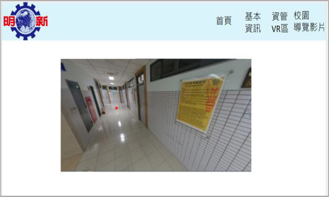

（圖 1-1） 

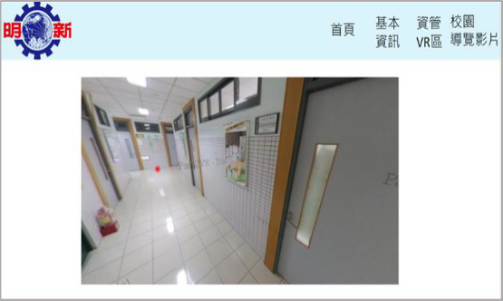

（圖 1-2\_透過點擊紅點可進行前進的導覽） 

（二）解決對於外界對學校環境資訊缺乏的問題

為了讓來賓和考生可以使用本系統體驗一些經常會用到的路線 來了解校園，提前進行較完整的校園體驗（圖 1-3）。此外我們也 可以建立 QRcode，請學校在來賓或者考生可以藉由簡章掃描

QRcode 或者給通過面試之考生寄送電子郵件的時候附上網址， 讓他們透過系統提前熟知路線，能加深外界對學校的印象與熟悉 感，從而達到提升校園形象與競爭力的效果。

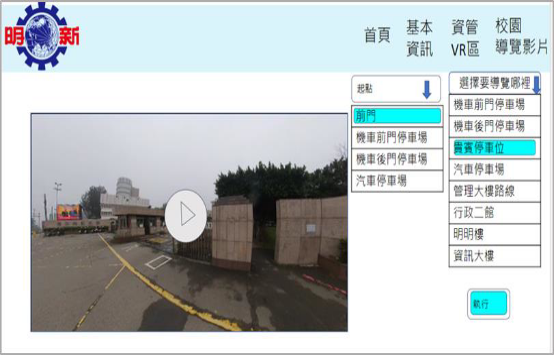

（圖 1-3） 

第二章 文獻探討

本次專題研究會以虛擬實境與資料庫作為系統開發的主軸。以網頁作 爲媒介，讓使用者以網站訪問資料庫以取得所需的虛擬實境空間。所 以接下來會透過虛擬實境(Virtual Reality)與資料庫(Database)進行文 獻探討。 

2-1 虛擬實境(Virtual Reality)  

虛擬實境（Virtual Reality，縮寫 VR），是利用電腦模擬產生一個三維 空間的虛擬世界，提供使用者關於視覺等感官的模擬，讓使用者感覺 彷彿身歷其境，可以即時、沒有限制地觀察三維空間內的事物。使用 者進行位置移動時，電腦可以立即進行複雜的運算，將精確的三維世 界影像傳回產生臨場感。該技術整合了電腦圖形、電腦仿真、人工智 慧、感應、顯示及網路並列處理等技術的最新發展成果，是一種由電 腦技術輔助生成的高技術模擬系統。

虛擬實境依 Burdea(1993)建議應以功能特性來定義 VR，他提出了 VR金三角的概念，即所謂 VR 應有互動性(Interaction), 指在計算機 生成的虛擬環境中，人們可以與虛擬環境與物件進行交互、沉浸性 (Immersion)  指利用計算機產生的三維立體圖像，讓人就算置身於虛 擬環境中也像在真實的客觀世界中一樣，與想像性(Imagination)，指 虛擬環境可使用戶沉浸其中並且獲取新的知識或聯想。虛擬實境是一 個由電腦繪圖或影像合成技術，結合聲音處理，產生一個具有 3D 立 體空間的虛擬世界，使用者可以透過特定的輸入設備，例如：頭戴『頭 盔顯示器』與『位置追蹤器』，手握『3D 滑鼠』或戴上『數位手套』 等設備與虛擬世界間產生互動，讓使用者自由的悠遊其中並有強烈的 融入感(沉浸性)與參與感(互動性)。雖然在這虛擬世界中的物件是虛 構的，人在裏面卻覺得好像就是在真實的世界一樣。(Wu & Chen 2002) 

虛擬實境可以以建構方式分爲物件式虛擬實境與影像式虛擬實境。 (一) 物件式虛擬實境

物件式虛擬實境是以虛擬實境開發軟件及 3D 建置軟件所製作， 從無到有建設出一個虛擬空間。此方法建置難度比較高，需要花 費更多時間。而且因需求運算量及數據量較大，網頁建置的物件 式虛擬實境需要較大的網路頻寬，伺服器也需要較强的運算能 力。而在較多的需求下，換來的就是更高的互動性與更好的立體 視覺效果，以及使用者可以自由的在虛擬空間移動，從而產生更 强的代入感。

(二) 影像式虛擬實境

影像式虛擬實境主要以 360°或 720°影像建置的實境圖片或影 片。此方法建置成本與所需時間都比較少，而且對網路頻寬與設 備需求較低，一般多媒體電腦就足以處理，適合與網站結合發 佈，減少使用者載入網頁時的漫長等待時間。而缺點就是系統與 使用者的互動較少。使用者幾乎只能根據建置好的固定視角，路 線與方式瀏覽，導致缺乏沉浸性。 

在本次研究中，預計會將物件式虛擬實境與影像式虛擬實境結合，以 混合式虛擬實境方式建構。把多個影像式虛擬實境建構成大型空間， 讓使用者可在空間内移動。再從虛擬空間中嵌入可互動物件，例如熱 點資訊與互動界面。這樣的混合式建構方法既可以得到物件式虛擬實 境所提供的高互動性與沉浸性，又能與網頁很好地結合，提高傳輸效 率。 

2-2 虛擬旅遊(Virtual tourism) 

旅遊電子化催生了電子旅遊、智慧旅遊、虛擬旅遊等各種新的旅遊方 式。 其中虛擬旅遊是將虛擬實境與旅遊融為一體的融合概念。 其最 簡單的形式包含觀光目的地的影片。用戶可以觀看和收聽智能手機、 平板電腦或桌上電腦上的內容，刺激他們的聽覺和視覺感官,使人們 足不出戶就能以身臨其境的方式遊覽世界。 隨著每個人都可以使用 智能手機實時訪問世界任何角落的任何地方，虛擬旅遊產生了極大的 吸引力。（Sanjeev Verma 等  2022） 

關於虛擬旅遊的定義，有學者提出虛擬旅遊是“由一系列影像組成的 現有位置的模擬”。(Osman 等 2009) 

Lu 等(2021)對虛擬旅遊給出了相對廣義的定義，包括虛擬現實

- VR）、增強現實（AR）、直播和旅遊流媒體。

Sr 等(2020)則認爲 VR 是虛擬旅遊的主要的支撐技術。360 度影片被 稱為一種基於桌面或移動設備的 VR，是目前最流行、成本最低、最 溫和的 VR 應用。 

技術接受模型(TAM)由 Davis (1989)  提出，用於預測個人對信息技術 的接受度。假設用戶接受度和行為意圖的兩個基本決定因素：感知有 用性和感知易用性。感知有用性是指人們相信信息技術將幫助他們更 好地完成工作的程度。感知易用性是指應用程序是否易於使用，這意 味著使用該應用程序所付出的努力不會超過性能優勢。

- Yu-Chih Huang 等 2013）發現感知易用性和感知有用性的技術接受 因素與體驗虛擬旅行網站時觀光的行為意圖有直接的正相關關係，表 明在觀光決策過程中使用虛擬世界的功能方面有助於增加人們未來 訪問觀光目的地的興趣。此外，該研究表明感知易用性和感知有用性 對虛擬旅遊目的地遊覽期間的愉悅體驗具有積極和顯著的影響，也有 助於在虛擬旅遊實地參觀期間也能享受愉快的體驗，在潛在遊客對旅 遊目的地的情感投入方面發揮重要作用。

  結合以上所述，虛擬旅遊網站的開發應注意感知易用性和感知有用性 的技術接受因素，開發對虛擬世界平台中的旅行計劃有用且易於使用 的網站。目標是盡量讓使用者更有可能享受和參與該網站規劃的遊覽 方向，為他們帶來積極正面的虛擬體驗，影響使用者在未來的行程上 的規劃和考慮，促進該目的地的發展與評價。

  2-3 資料庫(Database)應用 

  在作業系統出現之後，隨著電腦應用範圍的擴大、需要處理的資料迅 速膨脹。最初，資料與程式一樣，以簡單的檔案作為主要儲存形式。 以這種方式組織的資料在邏輯上更簡單，但可延伸性差，存取這種資 料的程式需要了解資料的具體組織格式。當系統資料量大或者使用者 瀏覽量大時，應用程式還需要解決資料的完整性、一致性以及安全性 等一系列的問題。因此，必須開發出一種系統軟體，它應該能夠像作 業系統封鎖了硬體存取複雜性那樣，封鎖資料存取的複雜性。由此產 生了資料管理系統，即資料庫。

  兩大資料庫公司 Oracle 與 Microsoft 分別對資料庫作出以下的説明。 Oracle：資料庫是結構化的資訊或資料集合，通常以電子方式儲存在 電腦系統中。資料庫通常由 DBMS 控制。資料和 DBMS 以及與之 關聯的應用程式統稱為資料庫系統，通常簡稱為資料庫。

  Microsoft：電腦科學中「資料庫」定義為儲存在電腦系統中的資料的 資訊集合。

  可見資料庫是指在電腦系統中的資料集合的統稱。

  當中 Oracle 説明提到的 DBMS 即資料庫管理系統（Database Management System）是為管理資料庫而設計的電腦軟體系統，一般 具有儲存、擷取、安全保障、備份等基礎功能。資料庫管理系統可以 依據它所支援的資料庫模型來作分類，例如關聯式、XML；或依據 所支援的電腦類型來作分類，例如伺服器群集、行動電話；或依據所 用查詢語言來作分類，例如 SQL、XQuery；或依據效能衝量重點來 作分類，例如最大規模、最高執行速度；亦或其他的分類方式。不論 使用哪種分類方式，一些 DBMS 能夠跨類別，例如，同時支援多種 查詢語言。

  以 CRUD 概念套用至本導覽系統

  增加（Create）:管理者增加導覽路綫及地點

  查詢（Read）:使用者查詢所需導覽路線及地點 更新（Update）:管理者更改導覽資訊或簡介

  刪除（Delete）:管理者刪除已廢除的導覽動線與地點

第三章 研究方法

3-1 系統開發方法

雛形模式由美國計算機科學家 Adele Goldberg 和 Alan Kay 提出

- Goldberg, A., & Kay, A. 1976）。此模式先針對使用者需求較清楚的 部分或資訊人員較能掌握之部分，依分析、設計與實施等步驟快速開 發雛型。開發過程 中，強調儘早以雛型作為使用者與資訊人員需求溝通與學習之 工具，雙方透過雛型之操作與回饋，釐清、修改及擴充需求， 並藉以修改與擴充雛型。上述步驟反覆進行，直到系統符合雙 方約定為止。 以此虛擬實境導覽系統爲例，先從與系主任確認系統需求，然後以快 速開發的方法建立系統外觀及導覽動線，然後在系統中加入問卷回饋 機制，讓我們能夠從各方面不斷得到回饋。再根據回饋更改系統外觀 及虛擬實境建設方法，從而提升系統的使用者滿意度，讓系統發揮最

  大效用。 

  2023/02/08 已與指導教授及系主任討論，完成第一次的系統需求截取 與分析。 

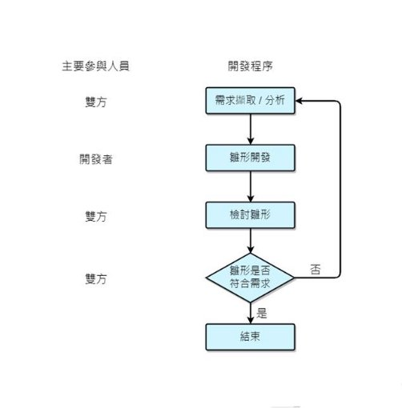

（圖 3-1\_雛型模式流程）

3-2 系統分析與設計

3-2-1 需求分析 

功能性需求：

- 提供虛擬實境方式查看資管系環境 
- 提供資管系地圖協助使用虛擬實境導覽 
- 提供搜尋的方式連接到指定資管系虛擬實境錨點 
- 提供虛擬實境影片方式查看校園常用路線
- 提供以起始地點的搜尋方式查找虛擬實境影片 
- 提供以目標地點的搜尋方式查找虛擬實境影片 
- 提供資管系或招生有關的實用資訊與連結
- 使用者提供使用心得或建議 

非功能性需求：

- 提供網站使用説明協助使用者
- 系統必須能允許多名使用者同時並穩定使用 
- 擁有延展性以便增加内容
- 必須兼容衆多常見的瀏覽器
- 使用響應式網頁設計

3-2-2 系統分析圖

UML 的全名為 Unified Modeling Language ，譯作統一模型語言。

由 Rational Software公司在 1997年提出(Booch, G., Rumbaugh, J.E., 

& Jacobson, I. 1998)。此語言是在物件導向軟體工程領域的一個標 準的通用性(general purpose)模型語言，通常用以呈現系統的各個 功能。 我們將使用“使用案例圖“（圖 3-2）、”活動圖“（圖 3-3）與”循序圖 “（圖 3-4）來建立系統模型。 

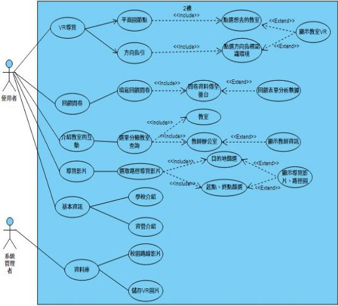

（圖 3-2\_使用案例圖）

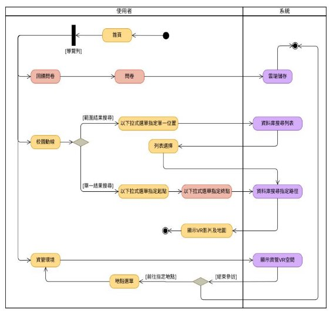

（圖 3-3\_活動圖） 

（圖 3-4\_循序圖） 

3-2-3 資料庫設計

資料庫關聯表有助資料庫的設計。通過圖表可以清晰地瞭解資料結構 及及早考慮資料完整性，此外設計圖是一種視覺化工具，可以幫助團 隊成員之間更好地溝通。

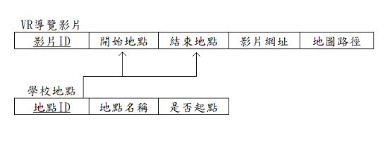

（圖 3-5\_資料庫關聯表綱要）

3-3 研究工具與設備 

本次研究以 Insta360 One x 作爲拍攝設備。

影像編輯方面以 Insta360 ONE X 作影像處理；Pano2VR 為 VR 編輯 軟體。 

網頁設建置方面使用 Microsoft Visual Studio 作爲網站開發工具； Microsoft SQL Server 2019 為資料庫；

Internet Information Server (IIS)為網頁伺服器。

網頁將使用 ASP.NET MVC 作為框架進行開發。

3-4 問卷回饋 

本次研究的回饋問卷將以 Google 表單進行設計，而問卷評量則以測

量技術接受模型（TAM）中的感知有用性與感知易用性作爲評測系統 的指標。問卷的内容參考賴（2015）針對技術接受模型的中文化量表 的研究，以此評估本系統在實務上的有效性與使用者體驗。 

第四章 實作與評估

4-1 實作示意圖

|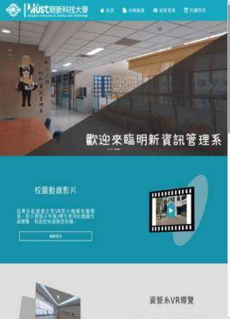|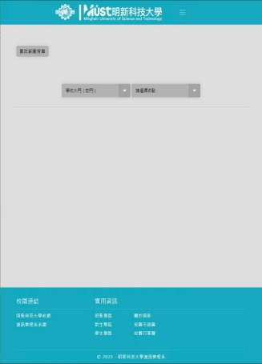|
| - | - |
|首頁 |指定影片搜尋|
|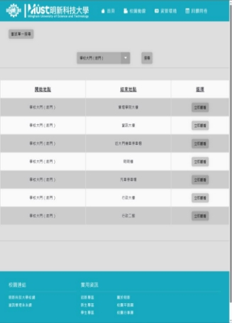|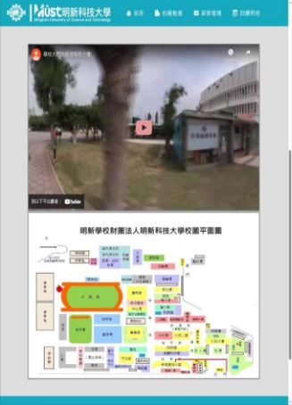|
| - | - |
|單一地點搜尋列表|全景影片與路線地圖|
|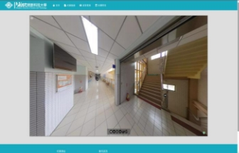|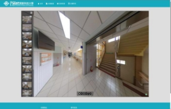|
|資管 VR 空間 |VR 地點列表 |

（圖 4-1\_實作系統截圖）

4-2 瀏覽器測試 

本系統用於大衆校園導覽之用，故研究者定下系統能兼容衆多常見的 瀏覽器為非功能性上的需求。本次研究中研究者使用 Brave， Chrome，Opera，Edge，Samsung browser 及 Safari 測試本導覽系統， 以下為測試過程擷圖。

|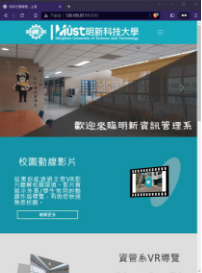|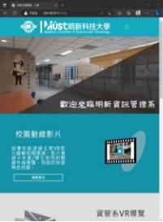|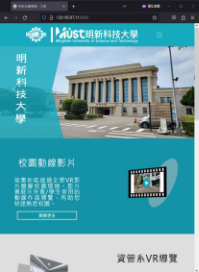|
| - | - | - |
|Brave |Edge |Firefox |
|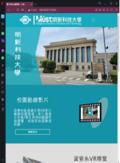|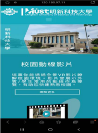|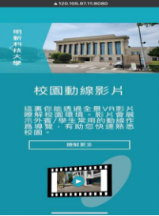|
|Opera |Samsung browser |Safari |

（圖 4-2\_瀏覽器測試截圖）

4-3 問卷調查 

本次統計數據從問卷 79 則回饋進行分析。

以使用意願方面，有 69.7%使用者有使用本系統的意願，也有 71%使 用者表示如有需要會繼續使用本系統。

在系統功能方面，下以"本校"代替"明新科大及該校的資管系"。有 72.1%使用者同意系統讓他們更容易認識本校，73.4%使用者同意系 統讓他們更完整認識本校，73.5%使用者同意系統讓他們更快速認識 本校。總的來説，有 73.4%使用者同意本系統有助於他們瞭解本校環 境。 

![ref1]

（圖 4-3\_系統功能問卷截圖）

在使用體驗方面，69.6%使用者同意本系統的界面是清楚且容易理 解。72.2%使用者同意使用本系統不用花很多精神心力。70.9%使用 者同意本系統操作很容易上手。總的來説，70.8%使用者同意他們很 容易的利用本系統達成目的。

![ref2]

（圖 4-4\_使用體驗問卷截圖）

第五章 結論與未來展望

本次研究的目的在於解決未來學生與外界對學校環境資訊缺乏資訊 的問題，並提升外界的信心及學校的形象。 透過本系統，我們期望在使用者方面能使用虛擬導覽增加對本校的認 識，避免對環境缺乏認識帶來的不便，從而提升其校園體驗。 而在學校方面，學校對外可以透過線上導覽提升外界對學校的認識， 對内可以增加學生對學校的認同感及歸屬感。在問卷調查中，我們得 知有高於七成的使用者同意本系統有助於他們瞭解本校環境，改善了 研究動機所描述的問題，並證明虛擬實境導覽系統的確較傳統平面圖 和照片更有助使用者達成瞭解環境資訊的目的。 現在本系統還有不少可改善的地方，例如增加虛擬空間的大小及在虛 擬環境中提供更多資訊等。我們期望將來能繼續完善系統，更大程度 上發揮本系統應有效用。 最後依照本研究背景的論述，虛擬實境已經充斥在我們的日常生活 中。我們期望未來虛擬實境會應用在更多不同的領域，改變人們的活 動與溝通模式，建立真正意義上的下一代社交網絡。

附錄一 參考文獻 

Booch, G., Rumbaugh, J.E., & Jacobson, I. (1998). The Unified Modeling Language User Guide. J. Database Manag., 10, 51-52. 

Burdea, G.(1993). Virtual Reality System and Application, Eletro’93 International Conference. NJ: Short Course. 

Davis,F.D.(1989). Perceived usefulness, perceived ease of use, and user acceptance of information technology, MIS quarterly,13 (3) : 319–340. 

Goldberg, A., & Kay, A. (1976). Personal dynamic media. ACM SIGGRAPH Computer Graphics, 10(3), 31-41. 

Huang, Y., Backman, S. J., Backman, K. F., & Moore, D. (2013). Exploring User Acceptance of 3D Virtual Worlds in Travel and Tourism Marketing. Tourism Management, 36, 490–501. https://doi.org/https://doi.org/10.1016/j.tourman.2012.09.009. 

Lu,J., Xiao,X., Xu,Z., Wang,C., Zhang,M., and Zhou, Y. (2021). The potential of virtual tourism in the recovery of tourism industry during the covid-19 pandemic. 

Osman,A.,Wahab,N.A., and Ismail,M.H. (2009). Development and Evaluation of an Interactive 360 Virtual Tour for Tourist Destinations. Journal of Information Technology Impact, 9 (3): 173–82. 

Sr, A., Ao, A., & Mi,B. (2020) . Emerging realm of 360-degree technology to promote tourism destination. Technology in society,63. 

Verma, S., Warrier, L., Bolia, B., & Mehta, S. (2022). Past, Present, and Future of Virtual Tourism-a Literature Review. International Journal of Information Management Data Insights, 2(2), 100085. https://doi.org/https://doi.org/10.1016/j.jjimei.2022.100085. 

Wu, S. kung, & Chen, C. ho. (2002). The Development of Image-Based VR Systems and Its Applications in the Travel Industry.  觀光研究學報, 8(1), 109–125. https://doi.org/10.6267/JTLS.2002.8(1)7 

賴宜弘,黃芬芬,& 楊雪華. (2015). 科技接受模式中文版量表之編制與 相關研究. 亞東學報, 35, 201–222. 

附錄二 完整問卷調查結果 

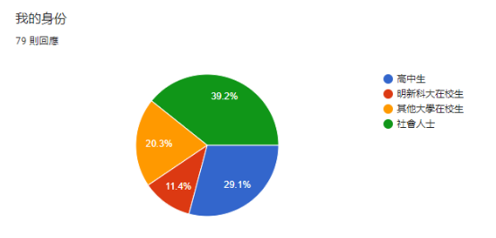

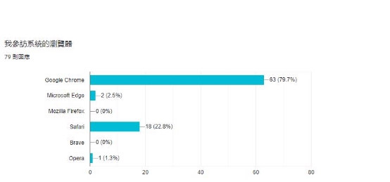

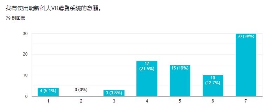

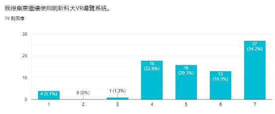

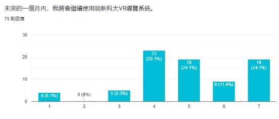

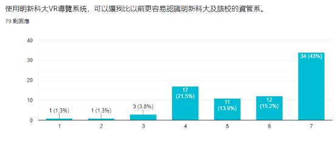

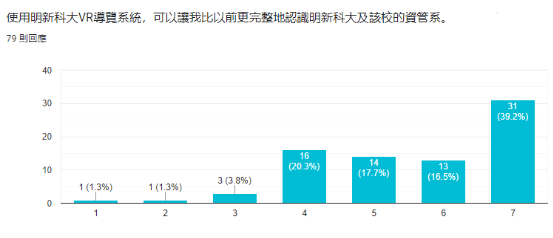

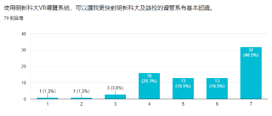

![ref3]

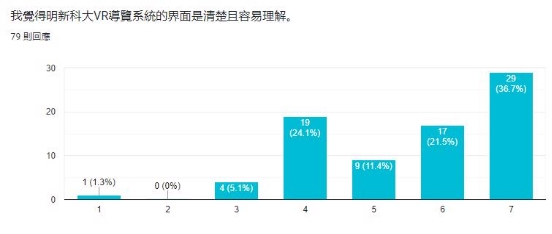

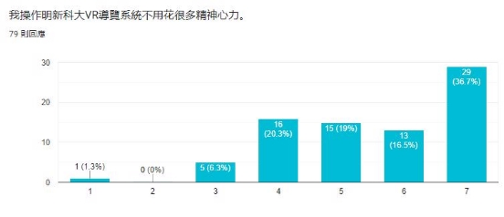

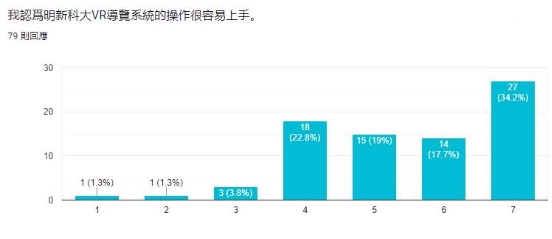

![ref4]

附錄三 評審老師意見 

老師：網站設計方面沒有經過設計，過於單調，導致最後成品不如理 想。 回應：因爲我們主要以系統開發爲主，組裏又沒有設計專業的學生， 以致最後外觀設計最後未如老師所期望。正如老師所講，好的設計可 以讓使用者更願意使用，也能為使用者帶來更好的體驗。如果系統後 續會繼續開發，我們會先學習及研究網站美術設計，或邀請相關設計 人員協助開發。

老師：VR 虛擬空間拍攝時沒有注意光綫與亮度等細節問題，例如有 些地方沒有開燈，沒有把最好的一面呈現給使用者，不符合"導覽" 的定義。 回應：感謝老師的提醒。細節決定成敗，日後一定會多加注意。
41 

[ref1]: Aspose.Words.c1f6d8cc-ed86-4e5b-940c-9b49797f6942.021.png
[ref2]: Aspose.Words.c1f6d8cc-ed86-4e5b-940c-9b49797f6942.022.jpeg
[ref3]: Aspose.Words.c1f6d8cc-ed86-4e5b-940c-9b49797f6942.031.png
[ref4]: Aspose.Words.c1f6d8cc-ed86-4e5b-940c-9b49797f6942.035.jpeg
